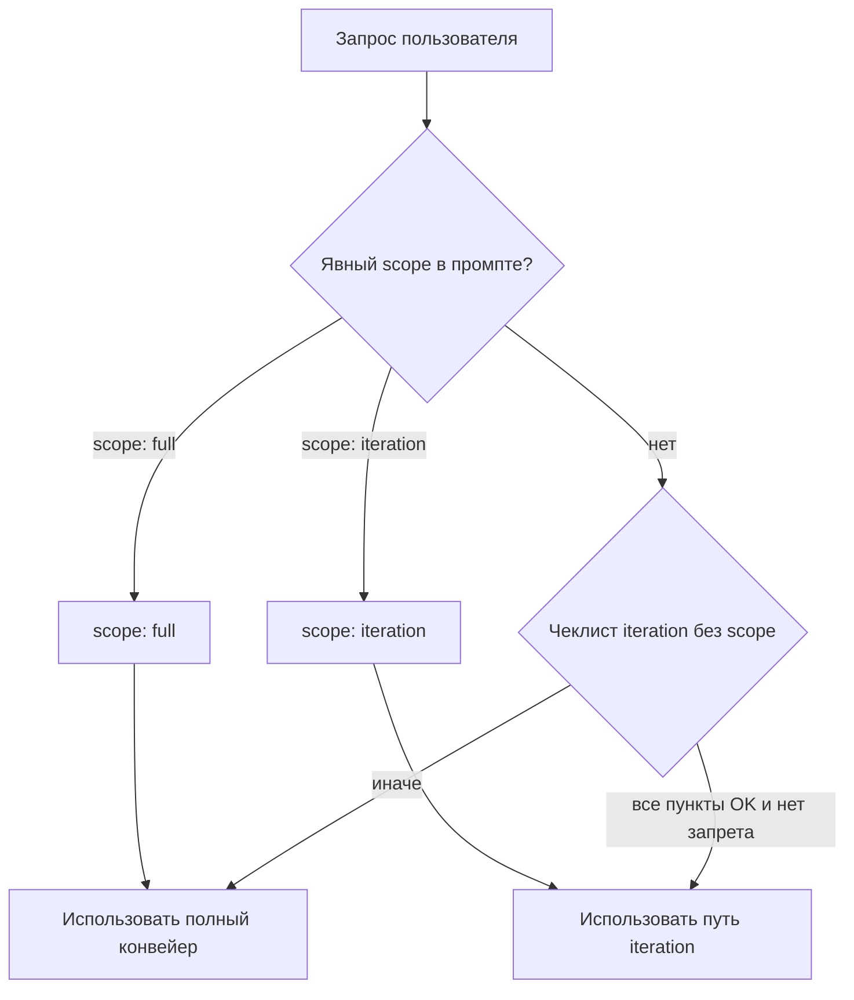

# Agent Workflow (Project-Local)

Этот проект использует локальные agent skills из папки `.agents`.

Цель: единый workflow для планирования, реализации и верификации изменений в `car-service-platform` без привязки к одному ассистенту.

## Для кого этот файл

- **Разработка и запуск приложения (люди, CI):** достаточно [`docs/spec/RUNBOOK.md`](docs/spec/RUNBOOK.md) и остальных спек в `docs/spec/`. **MCP и проверки IDE здесь не нужны.**

- **Работа через AI-агента в Cursor / Claude Code / Codex по этому репозиторию:** перед содержательными шагами — опциональная подготовка из **[`docs/dev/agent-session-bootstrap.md`](docs/dev/agent-session-bootstrap.md)** (MCP merge, `verify-agent-environment`, хостовые пакеты только если реально гоняете тесты вне Docker). Дубли MCP, hygiene, Codex — **[`docs/dev/mcp-deduplication.md`](docs/dev/mcp-deduplication.md)**; сжатый обзор ролей и MCP — **[`docs/dev/agents-and-mcp.md`](docs/dev/agents-and-mcp.md)**.

Эти три файла **не** входят в продуктовую спецификацию в `docs/spec/` — это вспомогательная документация для IDE-агентов.

## Структура

- `.agents/planner/SKILL.md` — декомпозиция задачи и исполнимый план.
- `.agents/architect/SKILL.md` — проверка архитектурной целостности.
- `.agents/domain-reviewer/SKILL.md` — проверка доменной корректности и бизнес-инвариантов.
- `.agents/backend-developer/SKILL.md` — реализация серверной части.
- `.agents/frontend-developer/SKILL.md` — реализация клиентской части.
- `.agents/e2e-validator/SKILL.md` — E2E-валидация через Playwright; при провале — фикс кода + unit-тесты.
- `.agents/e2e-testing/SKILL.md` — паттерны Playwright (POM, CI, артефакты, флаки); адаптация [ECC e2e-testing](https://github.com/affaan-m/everything-claude-code/blob/main/.agents/skills/e2e-testing/SKILL.md) с секцией overrides под этот репозиторий.
- `.agents/plan-reviewer/SKILL.md` — финальная сверка плана и результата.
- `.agents/renovate-verify/SKILL.md` — локальная проверка `renovate.json` через Docker (`renovate --platform=local`); скрипт `scripts/dev/renovate-local-verify.sh`.

## Обязательные Источники Контекста

- `docs/spec/PRODUCT.md` — стратегия и приёмочные темы (SDD).
- `docs/spec/TASKS.md` — backlog с стабильными идентификаторами `T-*` (`NOW` / `NEXT` / `LATER` внутри файла).
- `docs/spec/OPEN_QUESTIONS.md` — открытые решения; планировщик обязан явно фиксировать допущения, пока вопросы открыты.
- `docs/spec/README.md`, `docs/spec/SDD_WORKFLOW.md` — вход в SDD и связка с ролями/валидацией.
- `docs/spec/DOMAIN_RULES.md` — канонический источник доменных правил, статусов, расчетов и инвариантов.
- `docs/spec/TECH_STACK.md` — технический baseline и форма архитектуры.
- `docs/spec/RUNBOOK.md` — запуск dev/prod-like, демо-данные, публикация на LAN для мобильных.
- `docs/planning/archive/` — архив завершенных этапов и snapshot-планов.
- `docs/testing/playwright-e2e-framework.md` — целевой E2E-контур (детерминизм, CI, без ретраев).
- Опционально для **IDE-агентов** (не спека продукта): `docs/dev/agent-session-bootstrap.md`, `docs/dev/agents-and-mcp.md`, `docs/dev/mcp-deduplication.md`.

## Спеки и уточнения (SDD)

Агент **не обязан** перечитывать все файлы в `docs/spec/` на каждый чих, но **обязан** зайти в спеки, когда задача про продукт, приоритет, домен или неоднозначна:

1. **`docs/spec/TASKS.md`** — если пользователь сослался на `T-*`, эпик или «что дальше по плану»: сверить формулировку задачи с чекбоксом и не расходиться с ним без явного решения в чате.
2. **`docs/spec/OPEN_QUESTIONS.md`** — если ответа нет в коде и вопрос про поведение/данные: **не придумывать**; зафиксировать допущение в `Assumptions` и предложить пользователю закрыть вопрос или обновить спеку.
3. **`docs/spec/PRODUCT.md`** — если меняется смысл milestone, acceptance или scope (не только багфикс).
4. **`docs/spec/DOMAIN_RULES.md`** — при любых статусах, деньгах, PDF/snapshot, dashboard, staff vs admin (см. триггеры `domain-reviewer`).

Если пользователь дал **узкий** технический запрос (один файл, очевидная правка) и он **не** пересекается с доменом из `DOMAIN_RULES.md` — достаточно кода и минимальной верификации (`scope: iteration`).

## RUN_DIR (опционально)

- **По умолчанию** папку `RUN_DIR` **не создавать** и не требовать для выполнения задачи.
- **Создавать** `.agents/runs/<YYYYMMDD-HHMMSS>-<task-slug>/` **только если** пользователь явно просит об этом в промпте (например: «создай RUN_DIR», «зафиксируй артефакты в runs», «artifacts in .agents/runs», «полный отчёт в run-папке», «веди артефакты роли в .agents/runs»).
- Если пользователь указал **существующую** run-папку для дописывания — использовать её по инструкции из промпта.

## GitHub PR / MR Naming Convention

This repository uses Release Please, so every agent-created Pull Request / Merge Request title must be a valid Conventional Commit. GitHub squash merges use the PR title as the default squash commit title, and Release Please only creates release PRs from user-facing conventional commits.

Required format:

```text
type(scope): short imperative summary
```

Allowed `type` values: `feat`, `fix`, `perf`, `refactor`, `docs`, `test`, `ci`, `chore`, `build`, `style`, `revert`.

Rules for agents:

1. Before opening a PR/MR, choose the release impact first:
   - user-facing bug fix -> `fix(scope): ...`
   - user-facing feature -> `feat(scope): ...`
   - performance improvement -> `perf(scope): ...`
   - non-release docs/tests/CI/chore -> `docs(scope): ...`, `test(scope): ...`, `ci(scope): ...`, `chore(scope): ...`
2. Use a lowercase kebab-ish scope when useful: `repairs`, `vehicles`, `purchases`, `dashboard`, `e2e`, `release`, `agents`.
3. Do **not** create PR/MR titles like `Repairs: close modals on Escape`, `Add desktop Escape repair modal E2E`, or `Merge pull request ...`; rewrite them to conventional titles before opening or merging.
4. If GitHub shows a squash commit title before merge, ensure it still matches this convention.
5. If the change should create a release note, avoid `chore`, `docs`, and `test`; use `fix`, `feat`, or `perf` instead.

Examples:

- `fix(repairs): close modals on Escape`
- `feat(purchases): add supplier order draft flow`
- `test(e2e): stabilize vehicle registry search`
- `ci(release): validate PR titles`

## Режимы

- `mode: plan` — агент строит или уточняет план, код не меняет.
- `mode: execute` — агент реализует задачу по утвержденному плану.

Если режим не указан явно:

- если нет пошагового плана или задача сформулирована как исследование/дизайн -> `plan`
- если есть утвержденный план и запрос на реализацию -> `execute`

## Execution scope (`scope: full` | `scope: iteration`)

Ось **execution scope** независима от `mode: plan | execute` и задаёт, нужен ли полный конвейер ролей или ускоренный follow-up после уже согласованной работы в чате.

| Scope | Когда применять | Суть |
|--------|-----------------|------|
| **full** | Первый проход по крупной задаче; нет утверждённого плана в треде; меняются контракты, домен или архитектура; пользователь просит полный прогон / audit; сомнение «iteration или full» | `planner` → `architect` → `domain-reviewer` (по триггерам) → dev → post-`domain-reviewer` (по триггерам) → `e2e-validator` (по триггерам) → `plan-reviewer` |
| **iteration** | План уже согласован и реализован **в этом же чате** (или пользователь явно ссылается на него); правка **узкая** (один concern: баг, копирайт, мелкий UI, точечный тест); **нет** смены доменных правил и публичного API | Повторно **не** запускать `planner`, `architect`, `plan-reviewer` по умолчанию; только нужные роли и минимально достаточная верификация |

**Явные маркеры в промпте:**

- `scope: iteration` / «мелкая правка после плана» / «только фикс без полного пайпа» — ускоренный путь.
- `scope: full` / «полный workflow» — принудительно полный конвейер.

**Самоклассификация, если пользователь не указал `scope:`:** считать **`iteration`**, только если **одновременно**:

- изменение локализовано (ориентир: порядка 1–3 файлов или один экран без нового API);
- не затрагиваются статусы, расчёты и инварианты из `docs/spec/DOMAIN_RULES.md` (допустимы правки копирайта, комментариев, чисто презентационного UI без новой бизнес-логики);
- нет нового публичного API, нет миграций схемы БД.

Иначе — **`full`**. При любой неуверенности — **`full`**.

**Iteration запрещён** (всегда `scope: full`): миграции БД; новые/изменённые эндпоинты или контракт API; смена статусов, workflow, расчётов, eligibility; auth/permissions/биллинг; задача затрагивает несколько подсистем без явного «только точечный фикс» от пользователя.



## Обязательный Порядок Работы

### `scope: full` (полный конвейер)

1. Если пользователь явно запросил артефакты в runs — создать `RUN_DIR` (см. раздел «RUN_DIR (опционально)») или дописать в указанную папку.
2. Прочитать задачу и ограничения.
3. Запустить `planner` для пошагового плана.
4. Прогнать план через `architect`.
5. Если задача затрагивает бизнес-правила, статусы, доменные ограничения или расчеты, прогнать план через `domain-reviewer`.
6. Реализовать изменения через `backend-developer` и/или `frontend-developer`.
7. Если доменная логика менялась, прогнать итог через `domain-reviewer`.
8. Запустить `e2e-validator`, если срабатывают триггеры из раздела «Auto Routing Rules». При `fail` — `e2e-validator` исправляет код и добавляет unit-тесты, затем повторяет прогон до `pass`.
9. Прогнать итог через `plan-reviewer`.
10. Вернуть результат с кратким changelog и остаточными рисками.

### `scope: iteration` (follow-up)

1. Прочитать задачу и ограничения; при риске затронуть домен — свериться с `docs/spec/DOMAIN_RULES.md`.
2. Реализовать изменения через `backend-developer` и/или `frontend-developer` по триггерам из «Auto Routing Rules».
3. `domain-reviewer` — **только если** правка затрагивает бизнес-правила, статусы, расчеты, eligibility, ограничения или инварианты; иначе в ответе явно указать строку вида: `domain-reviewer: skipped — <краткая причина>`.
4. Верификация **минимально достаточная**: линт, unit или узко нацеленный тест по изменённому коду. `e2e-validator` / полный прогон Playwright — **только если** менялся UI или критичный пользовательский поток (или пользователь явно запросил E2E); не запускать «матричный» полный E2E без запроса.
5. Вернуть результат с кратким changelog и остаточными рисками.

Примечание по совместимости:

- `docs/spec/DOMAIN_RULES.md` мог ранее ссылаться на роль `domain-rules-reviewer`; в текущем workflow это имя заменено на `domain-reviewer`.

Форматы выходных отчетов:

- `plan-reviewer` -> `.agents/templates/plan-review-report.md`

## Локальное Хранение Артефактов

- База: `.agents/runs/`
- Один полный запуск с артефактами = одна папка `RUN_DIR` **когда** пользователь явно запросил фиксацию в runs или указал существующую папку.
- Рекомендуемый helper при явном запросе артефактов:
  - `scripts/agents/new-run.sh "task name"`

**Если** создан `RUN_DIR` или пользователь явно указал папку для дописывания, сохранять там по необходимости:

- `planner.md`
- `architect.md`
- `domain-review-plan.md` (если был pre-implementation domain review)
- `domain-review-final.md` (если был post-implementation domain review)
- `backend-developer.md` (если роль участвовала)
- `frontend-developer.md` (если роль участвовала)
- `e2e-validator.md` (если роль участвовала)
- `plan-review-report.md`
- `final-summary.md`

## Auto Routing Rules

Обязательные стадии зависят от **execution scope** (см. выше), а не от одного только `mode: execute`.

- В **`scope: full`**: после опционального `RUN_DIR` пройти полный список из подраздела «`scope: full`»; правила ниже определяют, какие из ролей `backend-developer` / `domain-reviewer` / `frontend-developer` / `e2e-validator` задействованы и в каком порядке относительно друг друга.
- В **`scope: iteration`**: не запускать заново `planner`, `architect`, `plan-reviewer` без явного запроса пользователя; применить подраздел «`scope: iteration`» и те же триггеры ролей ниже — только для задействованных ролей.

Триггеры ролей:

1. `backend-developer`, если задача затрагивает:

- API, endpoint, controller, service, repository
- DB, schema, migration, query, transaction
- auth, permissions, integrations, бизнес-правила

2. `domain-reviewer`, если задача затрагивает:

- бизнес-правила, workflow, state machine, статусы
- расчеты, eligibility, ограничения, инварианты
- терминологию предметной области и правила согласованности данных

3. `frontend-developer`, если задача затрагивает:

- page, component, layout, form, validation
- UX, state management, routing
- работу с API на клиенте

4. Обе роли, если задача сквозная:

- меняется API-контракт и одновременно UI
- новые поля/статусы приходят с backend и отображаются на frontend
- доменные статусы или правила проходят через backend и отображаются на frontend

5. `e2e-validator`, если задача:

- затрагивает пользовательский интерфейс или критичные пользовательские потоки
- изменяет поведение кнопок, форм, списков, навигации
- исправляет баг (регрессионная проверка)

В **`scope: iteration`** для пункта 5: запускать `e2e-validator` только при реальном изменении UI/критичного потока или по явному запросу пользователя, не как полный обязательный прогон всего набора без необходимости.

При конфликте приоритета:

- сначала `backend-developer`
- затем `domain-reviewer`
- затем `frontend-developer`
- затем `e2e-validator`
- затем `plan-reviewer` (только в **`scope: full`** или если пользователь явно просит сверку плана)

Важно:

- если задача затрагивает бизнес-правила, статусы, расчеты, eligibility, ограничения или инварианты, `domain-reviewer` обязателен **до или после реализации** в соответствии с выбранным scope (в `iteration` — только если правка действительно их затрагивает);
- в **`scope: full`** сохраняются pre-implementation и post-implementation domain review там, где это следует из триггеров;
- в **`scope: iteration`** приоритет списка выше не подразумевает обязательный прогон всех стадий полного конвейера.

## Hygiene For Planning

1. Active-контент планирования живёт в `docs/spec/` (`PRODUCT.md`, `TASKS.md`, …). Сами спеки держать сфокусированными, историю — в `docs/planning/archive/`.
2. Исторические completed-блоки переносить в `docs/planning/archive/`.
3. Перед крупной переработкой active-планов сохранять snapshot в архив.

## Контракт Между Ролями

Каждая роль обязана вернуть:

1. `Assumptions` — явные допущения.
2. `Decisions` — ключевые решения и почему.
3. `Output` — артефакт роли.
4. `Risks` — что может сломаться и как проверить.

## Правила Качества

- Не делать скрытых допущений.
- Не менять несвязанные части проекта.
- Для кода: минимум один способ верификации.
- Для планов: шаги должны быть проверяемыми и конечными.

## Минимальный Формат Ответа От Агента

```md
Role: <planner|architect|domain-reviewer|backend-developer|frontend-developer|e2e-validator|plan-reviewer>
Bootstrap: <`verify-agent-environment` OK | после bootstrap OK | deps-only | N/A — не IDE-агент / без MCP по задаче | пропущено — причина>
MCP hygiene: <N/A — не агентная сессия | по agent-session-bootstrap.md: напоминание выведено | N/A — минимальный набор>
Scope: <full|iteration>
Skipped roles: <кратко, если scope: iteration и роли намеренно не запускались; иначе "—">
Assumptions:
- ...
Decisions:
- ...
Output:
- ...
Risks:
- ...
```
