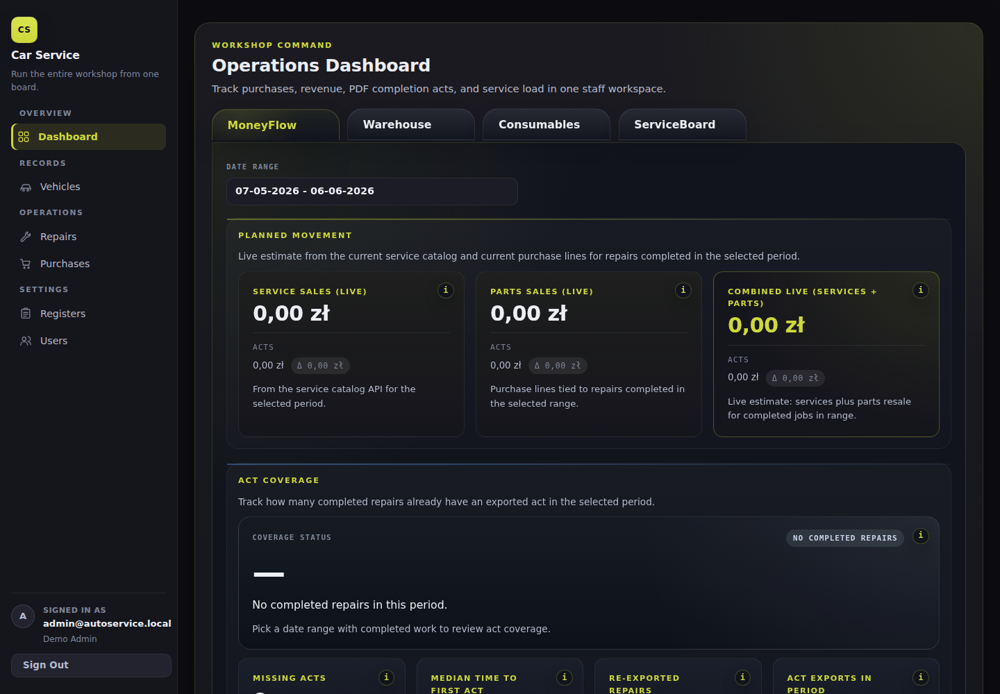

# Car Service Platform

Bootstrap for an autoservice operations platform: Django + DRF backend, React + Vite frontend, Docker Compose.

## Product showcase

Human-facing visual tour captured from the Docker dev stack with generated demo data: [`docs/showcase/README.md`](docs/showcase/README.md).



## Documentation (canonical)

| Topic | Location |
|--------|----------|
| Spec index (product, tasks, SDD, open questions) | [`docs/spec/README.md`](docs/spec/README.md) |
| **Run** dev / prod-like / LAN & demo load | [`docs/spec/RUNBOOK.md`](docs/spec/RUNBOOK.md) |
| **`scripts/`** index (compose, db, generated demo data, MCP, Allure, CI) | [`docs/spec/SCRIPTS.md`](docs/spec/SCRIPTS.md) |
| Domain rules (statuses, money, PDF, dashboard) | [`docs/spec/DOMAIN_RULES.md`](docs/spec/DOMAIN_RULES.md) |
| Technical stack & architecture | [`docs/spec/TECH_STACK.md`](docs/spec/TECH_STACK.md) |
| Agent workflow (roles, scope, routing) | [`AGENTS.md`](AGENTS.md) |
| Optional: IDE agents — MCP / verify / bootstrap | [`docs/dev/agent-session-bootstrap.md`](docs/dev/agent-session-bootstrap.md) |
| **Test pyramid** (unit → API → UI/E2E) + latest main snapshot | [`docs/testing/test-pyramid.md`](docs/testing/test-pyramid.md) · [`docs/testing/latest/README.md`](docs/testing/latest/README.md) |

### Test pyramid

Policy and soft targets: [`docs/testing/test-pyramid.md`](docs/testing/test-pyramid.md). Latest accepted `main` snapshot lives in [`docs/testing/latest/`](docs/testing/latest/): human-readable [`README.md`](docs/testing/latest/README.md), machine-readable [`pyramid-snapshot.json`](docs/testing/latest/pyramid-snapshot.json), and advisory [`pyramid-quality-gates.json`](docs/testing/latest/pyramid-quality-gates.json). PRs publish report artifacts/comments only; the scheduled/manual **Test Pyramid Snapshot Refresh** workflow updates `docs/testing/latest/` through a separate rolling PR from `main`.

Quick start (details in the runbook):

```bash
cp .env.example .env
bash scripts/compose/start.sh
```
