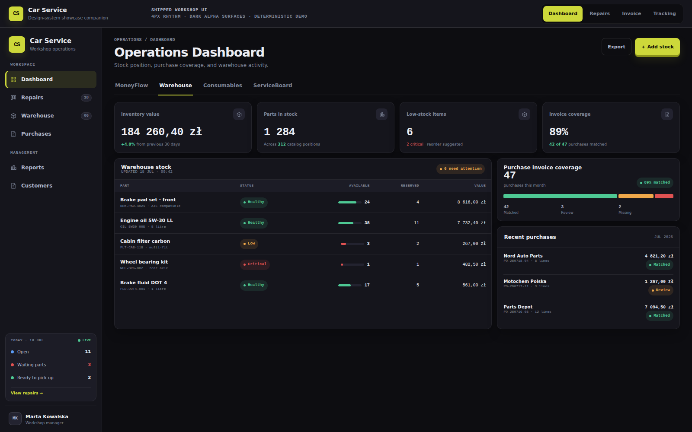
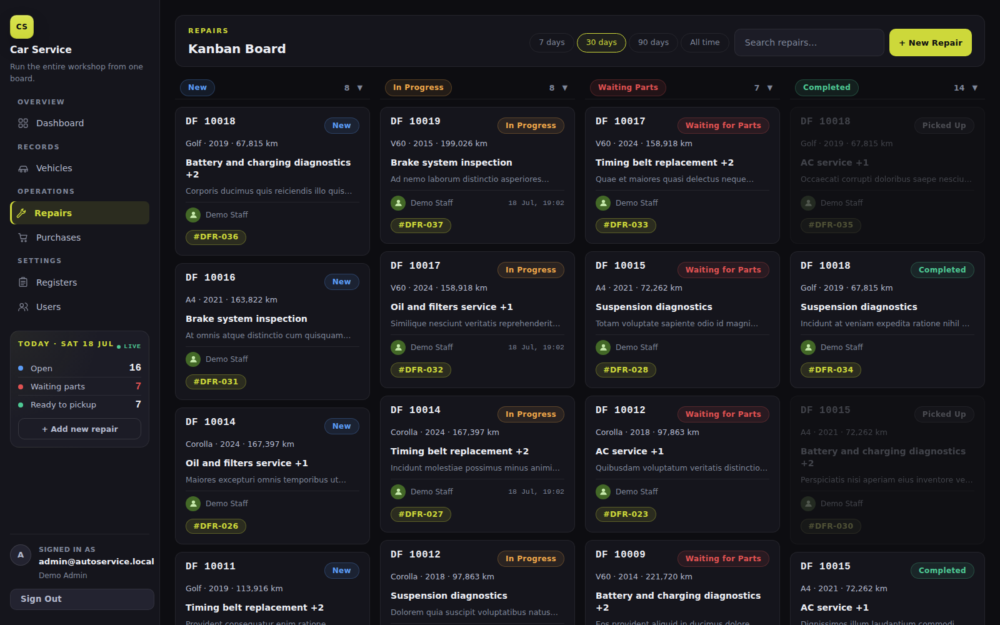
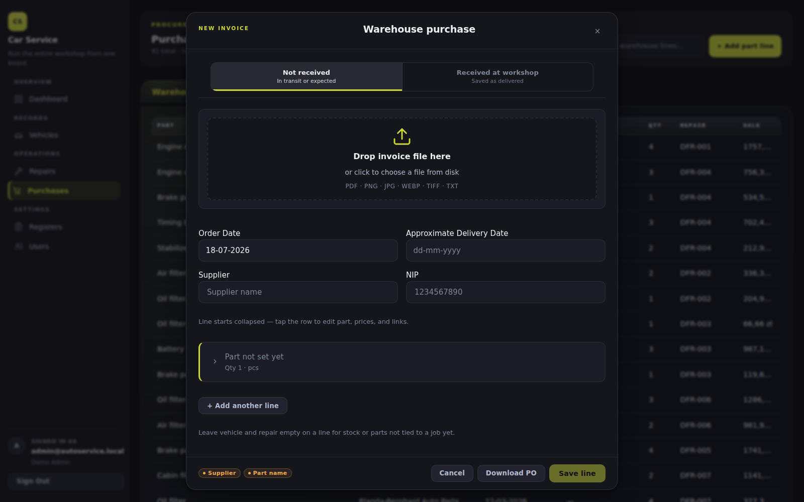
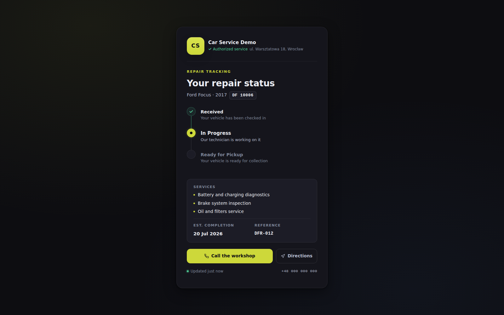

<div align="center">

# Car Service Platform

**Run the workshop from one focused workspace — repairs, parts, purchases, documents, and customer updates.**

Django + DRF · React + Vite + TypeScript · PostgreSQL · Docker Compose

[Quick start](#quick-start) · [Product spec](docs/spec/PRODUCT.md) · [Runbook](docs/spec/RUNBOOK.md) · [Issues](https://github.com/ylazakovich/car-service-platform/issues) · [Releases](https://github.com/ylazakovich/car-service-platform/releases)

</div>



> The hero is the OpenDesign/Claude Design dashboard target with deterministic synthetic counts. Its sidebar restores the live **Today** summary: open work, repairs waiting for parts, and vehicles ready to pick up. The repair board, invoice intake, and customer portal below were captured from the running application with synthetic demo data. No customer data or secrets are included.

## One workshop. One flow.

- **See the operation:** the sidebar surfaces open work, repairs waiting for parts, and vehicles ready to pick up; MoneyFlow, warehouse value, consumables, service load, and document coverage stay one click away.
- **Move repairs forward:** a vehicle-first Kanban board for `New`, `In progress`, `Waiting parts`, and `Completed` work.
- **Control purchasing:** upload invoice evidence, review suggested lines, connect parts to a repair, and confirm before saving.
- **Keep customers informed:** a scoped access-code portal shows repair progress, workshop details, click-to-call, and directions — without exposing the staff workspace.

## Product tour

### Repair board

Daily work stays visible by status, technician, vehicle, service, and tracking reference.



### Invoice intake

Supplier evidence and editable purchase lines stay together; operator confirmation remains part of the flow.



### Customer repair tracking

Customers see only their repair timeline, expected completion, workshop address, phone, and directions. The location link points to the workshop — it is not live vehicle GPS tracking.



## What is inside

| Area | Capabilities |
|---|---|
| Workshop records | Customers, vehicles, service catalog, units, users, suppliers |
| Repair operations | Repair lifecycle, services, masters, mileage, notes, tracking codes, PDF acts |
| Parts & purchasing | Warehouse and consumables, supplier purchases, invoice evidence/import, repair links |
| Visibility | MoneyFlow, stock and supplier analytics, ServiceBoard, document coverage |
| Customer experience | Access-code status page, workshop identity, phone, address, directions |

## Quick start

```bash
cp .env.example .env
bash scripts/compose/start.sh
```

Open `http://localhost:4173`. To replace local sample rows with generated connected demo data:

```bash
bash scripts/db/load-demo.sh
```

Default local credentials and all environment notes live in the [runbook](docs/spec/RUNBOOK.md). Production secrets must never be committed to `.env`, screenshots, fixtures, or documentation.

## Architecture

```text
React + TypeScript + Vite  →  Django REST Framework  →  PostgreSQL
           │                          │
        staff UI              domain rules + PDF
        client portal         media + integrations
```

The repository uses a modular Django backend, a responsive React staff workspace, API-backed customer tracking, Compose-based local/prod-like runtimes, and a unit → API → UI/E2E test pyramid.

<details>
<summary><strong>Documentation and contributor guide</strong></summary>

| Topic | Source of truth |
|---|---|
| Product, scope, and acceptance themes | [`docs/spec/PRODUCT.md`](docs/spec/PRODUCT.md) |
| Domain rules: statuses, money, PDFs, dashboard | [`docs/spec/DOMAIN_RULES.md`](docs/spec/DOMAIN_RULES.md) |
| Architecture and supported stack | [`docs/spec/TECH_STACK.md`](docs/spec/TECH_STACK.md) |
| Local, demo, LAN, and prod-like operation | [`docs/spec/RUNBOOK.md`](docs/spec/RUNBOOK.md) |
| Scripts index | [`docs/spec/SCRIPTS.md`](docs/spec/SCRIPTS.md) |
| Current backlog and open decisions | [`docs/spec/TASKS.md`](docs/spec/TASKS.md) · [`docs/spec/OPEN_QUESTIONS.md`](docs/spec/OPEN_QUESTIONS.md) |
| Test pyramid and latest accepted snapshot | [`docs/testing/test-pyramid.md`](docs/testing/test-pyramid.md) · [`docs/testing/latest/README.md`](docs/testing/latest/README.md) |
| Agent and contribution workflow | [`AGENTS.md`](AGENTS.md) |
| README showcase design system | [`docs/design/readme-showcase/DESIGN.md`](docs/design/readme-showcase/DESIGN.md) |

</details>
